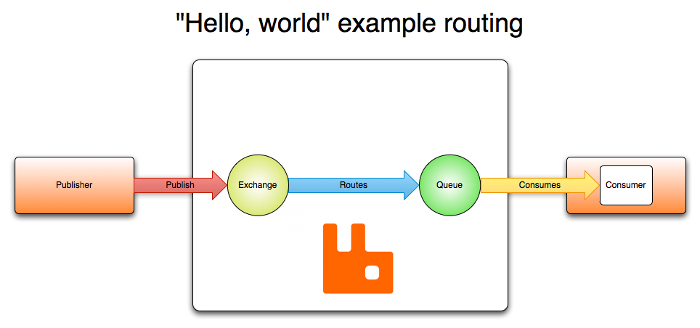
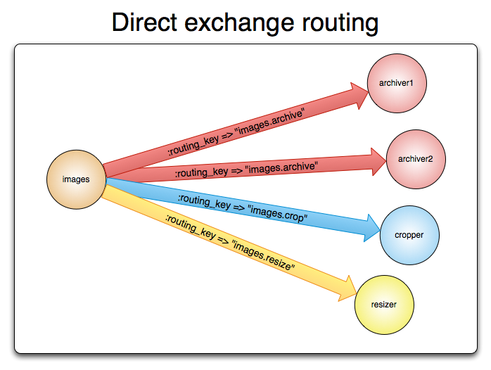

# RabbitMQ

RabbitMQ é um **message broker** implementado em Erlang que utiliza o protocolo AMQP para essa troca de mensagens.

Diferente dos protocolos de mensageira tradicionais, o AMQP utiliza o conceito de *exchanges* (no roteamento das mensagens) e *acknowledges* (para confirmação de recebimento).



Basicamente, os publishers enviam mensagens ao broker para uma exchange, e o broker realiza o roteamento da mensagem para filas existentes com base do tipo de exchange, estas filas serão consumidas pelos consumers que subscreveram nelas.

# Exchanges

Exchanges funcionam de forma semelhante a um serviço postal, recebem as mensagens e as redirecionam (routing) aos carteiros (queues).

As regras de roteamento são chamadas de *routing keys*.


> 💡 Uma diferença na analogia do serviço postal é que as mensagens são efetivamente copiadas para as filas, e uma mesma mensagem pode ser roteada para mais de 1 uma fila.


Um producer de mensagens nunca as envia diretamente para filas, ele sempre envia para exchanges. O trabalho da exchange se resume a receber mensagens dos producers e enviar estas mensagens para queues.

A exchange sabe exatamente o que deve fazer com as mensagens que recebe, se vai enviar para uma ou mais filas, se a mensagem deve ser descartada, etc. Tudo depende do tipo de exchange que recebeu a mensagem.

> 💡 In AMQP 0-9-1, messages are load balanced between consumers and not between queues.

### Exchange Types

| **Exchange type** |      **Default pre-declared names**     |
|:-----------------:|:---------------------------------------:|
| Direct exchange   | (Empty string) and amq.direct           |
| Fanout exchange   | amq.fanout                              |
| Topic exchange    | amq.topic                               |
| Headers exchange  | amq.match (and amq.headers in RabbitMQ) |


## Direct Exchange

Entrega mensagens de acordo com a routing key. É ideal para comunicações *unicast* (também pode realizar envios *multicast*).



## Fanout Exchange

Exchanges do tipo fanout roteiam as mensagem a todas as filas que estejam ligadas (*bound*) a elas. Elas ignoras as *routing keys.* É ideal para envios *broadcast.*

Quando uma mensagem é enviada a uma exchange fanout, uma cópia da mensagem é enviada a todos as queues.


## Topic Exchange

Envia mensagens para 1 ou N queues com base no *matching* entre a routing key utilizada e o padrão definido na ligação da queue com a topic exchange.

Esse tipo de exchange é utilizado na implementação de padrões publish/subscribe e suas variações.

Sempre que houve um problema que envolva múltiplos consumers/aplicações que seletivamente devem decidir quais mensagens irão receber, deve ser considerado a utilização da exchange topic.

Uma característica imporante da topic exchange está na binding keys, que podem ser compostas por palavaras separadas por pontos '.' e podem utilizar de wildcards.

> \* (star) - substitui uma palavra (até o próximo ponto **'.'**)

> \# (hash) - substitui 0 ou mais palavras (independente da divisão utilizando ponto **'.'**)

## Header Exchange

É a exchange utilizada para realizar o roteamento utilizando múltiplos atributos que são definidos através de *headers* ao invés de *routing keys*.

Essa exchange ignora a routing key utilizando atributos do header como chaves para realizar o roteamento.

Uma característica interessante é a utilização do argumento "x-match" no binding, quando esse argumento é utilizado com o valor "*any*", caso pelo menos 1 atributo do header der match, já é suficiente para rotear a mensagem.


# Queue

No AMQP queues são buffers de mensagens.

A ligação entre uma exchange e uma queue é chamada de *binding*.

## Propriedades

1. Nome
2. Durável (se a queue deve sobreviver após um restart do servidor)
3. Exclusiva (se a fila será exclusiva de determinada conexão, e quando esta for fechada a fila sera deletada)
4. Auto-delete (se a fila é removida quando o último consumer realizar o unsubscribe)
5. Argumentos (tempo de vida, tamanho da vila, etc)


# Bindings

Bindings podem ser descritos como regras que as exchanges utilizaram para rotear mensagens para queues.

```
To draw an analogy:

Queue is like your destination in New York city
Exchange is like JFK airport
Bindings are routes from JFK to your destination. There can be zero or many ways to reach it
```

# References

1 - [https://www.rabbitmq.com/tutorials/amqp-concepts.html](https://www.rabbitmq.com/tutorials/amqp-concepts.html)
